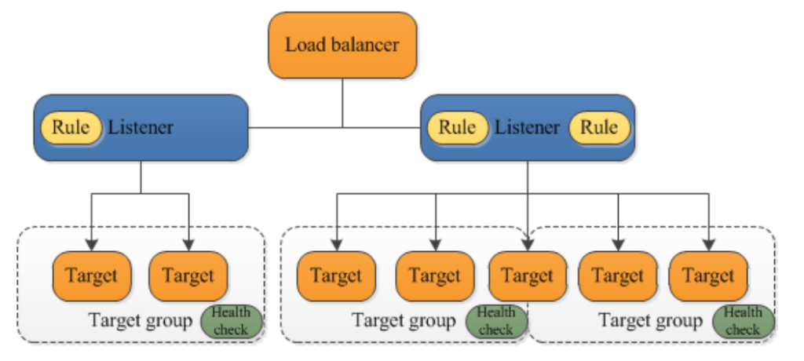

[utb](https://www.youtube.com/watch?v=su9VDwCrCos)
[medium](https://devopslearning.medium.com/21-days-of-aws-using-terraform-day-4-creating-application-load-balancer-alb-using-terraform-210b1fd4a2c0)
[blog](http://100daysofdevops.com/21-days-of-aws-using-terraform-day-4-creating-application-load-balanceralb-using-terraform/)

Load Balancer

Server1 Server2
50%     50%

Elastic Load Balancer --> Layer 4 + Layer 7
Application Load Balancer (ALB) Layer7
* Network Load Balancer (NLB Layer 4)
    * Target Group
        * Server 1 (/image)
        * Server 2 (/homefolder )

### On the console
* Configure Application Load Balancer
    * Create Target Group
        * Name
        * Target Type --> instance, IP,  Lambda 
        * Protocol --> HTTP
        * Port 80(http), 443(https)
        * VPC
    * Health Check
        * Protocol
        * Path
        * Level threshold Healthy 5, Unhealthy 2, Interval 30 * 2, Success 200
* Create Load Balancer
    * Name
    * Scheme -- Internet facing, Internal
    * IP Address Type ipv4,   Dual stack
    * Listener
        * Protocol
        * Port
    * Availability Zones
        * VPC
            * At least 2 zones
    * Security Settings
    * Security Groups (Create/Choose)
    * Configure Routing  
        * Choose or Create
            * Create Target Group -- above
        * Register Target 
    

