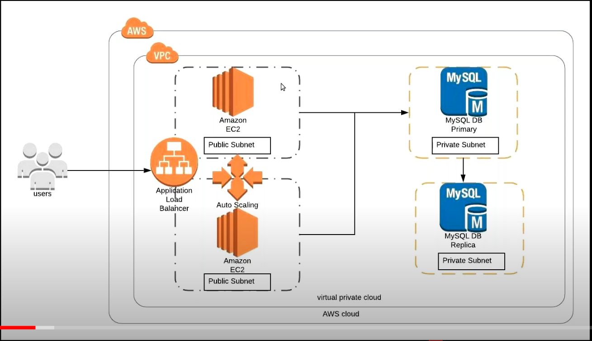

[blog](http://100daysofdevops.com/21-days-of-aws-using-terraform-day-5-aws-auto-scaling-group-using-terraform/)
[Youtube](https://www.youtube.com/watch?v=0zl_Q9LY69A)
[Medium](https://devopslearning.medium.com/21-days-of-aws-using-terraform-day-5-aws-auto-scaling-group-using-terraform-c946e6fde71d)

## Auto Scaling
Min 2, Max 10, Desired 4
cpu > 80% -->increase
cpu < 40% --> Decrease

### Create Launch configuration
* Select AMI
    * Name
    * Purchase options:  On demand (pay by hour), reserved (pay time (e.g. 1 year)), Spot, Dedicated
    * IAM role (not required)
    * Enable Monitoring  -not required
    * Advanced Details
        * User data (script to install packages, start running)
    * Add Storage 
        * Size
        * Type
    * Security Group
        * create  -- name and rules
    ? Key

## Auto Scaling 

* Create Auto Scaling Group
    * name
    * launch configuration
    * Size
    * vpc
    * Subnet list
    * Advanced
        * More lb bool
        * Helth Check grace in seconds
        * Monitor bool
        * Instance Protection
        * IAM service role
    * Policy to keep size or adjust capacity (if adjust ...)
        * min and max
            * increase groups ...
            * decrease groups (almost same)
            * cloud watch
                    * sns
                    * rule average,action CPU %, < > =, max% time(num, periods)
                    * name of alarm
            * name
            * type
            * target
            * Instances need
            * Disable scale i bool
        * Notifications
        * Tags

